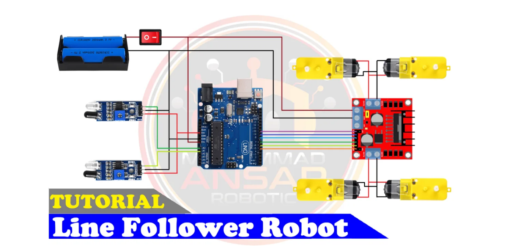

### Documentation:

## Arduino Base Black Line Follower Robot

## Introduction

An interesting project that incorporates robotics, electronics, and programming is building a line follower robot. We’ll walk you through the process of creating your very own black line follower robot on an Arduino platform in this blog article. This project is a fantastic chance to practice your programming abilities in a real-world scenario, in addition to learning a lot about robotics. Now let’s dig in and discover the intriguing realm of robots that follow lines!

## Components:

- 5mm Acrylic Sheet (20cm x 12cm) / 5mm Chases sheet
- DC Gear Motor x 4 / 2x
- Front wheel 1x if 2wheels robot
- Arduino UNO
- IR Sensor x 2
- L298 Motor Driver
- Smart Robot Car Tyers Wheels x2 /4x
- Male to Female Jumper Wires 30x
-	On/Off Switch
-	18650 Battery Holder – 2 Cell
-	18650 Battery Cell 3.7V x 2

## Circuit Diagram

Knowing how the parts fit together is crucial before beginning the assembling process. A condensed circuit diagram that shows how each component works together is shown below. To guarantee correct operation, carefully follow this diagram. In this circuit diagram, an Arduino UNO is used as a microcontroller. A L293D motor driver is used that drives four dc motors. Two IR sensors are used to detect any obstacle on the way. Two cells of 3.7 volts are used as a power source. A power on/off switch is used. Output of the IR sensors are connected to A0 and A1 pin of the Arduino UNO.

